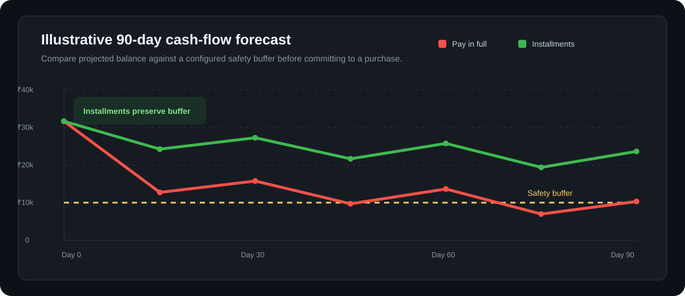

<div align="center">

# Finance AgentX

### An explainable purchase-safety agent for personal finance

*Forecast your cash flow. Evaluate the trade-off. Make the reasoning visible.*

[](https://www.python.org/)
[](#decision-engine)
[](#how-it-works)
[](#)

</div>

> Finance AgentX analyses financial history and a proposed purchase to recommend whether to **pay now**, **split into installments**, or **wait**—with an auditable explanation rather than a black-box answer.

> **Educational project only.** It does not provide investment, lending, credit, or professional financial advice.

<div align="center">
  
</div>

## Why it exists

A purchase may look affordable from today’s account balance but still cause a shortfall after rent, subscriptions, repayments, or a gap before the next income event. Finance AgentX evaluates the **future cash position**, not only the present balance.

| Recommendation | When it is selected |
|---|---|
| **Pay in full** | A one-time payment preserves the required cash buffer throughout the forecast. |
| **Split into installments** | Paying in full is unsafe, but an evaluated installment plan keeps the projected balance within policy. |
| **Wait** | No evaluated payment option meets the cash-safety rules. |

## What it does

- Builds a **90-day balance forecast** from historical transactions and profile data.
- Detects **recurring expenses** such as subscriptions and regular commitments.
- Analyses income patterns and models expected cash inflows.
- Evaluates the proposed purchase as a full payment and across installment options.
- Uses deterministic rules to produce **reproducible, inspectable decisions**.
- Extracts supporting context from receipt images and messages when supplied.
- Runs validation, diagnostics, calibration, and evaluation workflows.

## How it works

```text
Financial history + profile + purchase request
                    │
                    ▼
  Income analysis · recurring-expense detection · evidence extraction
                    │
                    ▼
             90-day cash-flow forecast
                    │
                    ▼
     Deterministic policy + installment-plan solver
                    │
                    ▼
      PAY IN FULL  ·  INSTALLMENTS  ·  WAIT
             rationale + validation output
```

## Decision engine

The final recommendation is made by a deterministic policy layer, not by a language model. That design keeps the decision path transparent: the same inputs and configuration lead to the same output, making the system easier to test, calibrate, and audit.

**Core principles**

1. Forecast before deciding—current balance alone is not enough.
2. Protect a configured cash buffer across the full forecast horizon.
3. Compare alternatives before rejecting a purchase.
4. Surface the evidence and rules behind every recommendation.
5. Validate financial inputs and output constraints.

## Project architecture

```text
finance-agentx/
├── code/
│   ├── main.py              # Application entry point
│   ├── data.py              # Data loading and preparation
│   ├── income.py            # Income analysis
│   ├── recurring.py         # Recurring-expense detection
│   ├── forecast.py          # Time-based balance projections
│   ├── decide.py            # Deterministic decision policy
│   ├── solver.py            # Installment-plan evaluation
│   ├── extract_images.py    # Receipt-image evidence extraction
│   ├── extract_messages.py  # Message evidence extraction
│   ├── validate.py          # Output validation
│   ├── diagnose.py          # Diagnostics
│   ├── calibrate.py         # Rule calibration
│   └── config.py            # Configuration
├── dataset/                 # Input datasets
├── evaluation/              # Evaluation assets
├── output.csv               # Example generated output
├── requirements.txt         # Dependencies
└── problem_statement.md     # Domain context
```

## Tech stack

| Area | Tools and approach |
|---|---|
| Language | Python |
| Data | CSV-based workflows and transaction analysis |
| Forecasting | Time-based balance projections |
| Decisioning | Deterministic financial rules and installment constraints |
| Evidence | Receipt-image and message extraction utilities |
| Reliability | Validation, diagnostics, calibration, and evaluation scripts |

## Quick start

```bash
git clone https://github.com/aditya-c7/finance-agentx.git
cd finance-agentx
python -m venv .venv
```

Activate the environment and install dependencies:

```bash
# macOS / Linux
source .venv/bin/activate

# Windows PowerShell
# .venv\Scripts\Activate.ps1

pip install -r requirements.txt
```

Run the agent from the repository root:

```bash
python code/main.py
```

Useful supporting workflows:

```bash
python code/validate.py
python code/diagnose.py
python code/calibrate.py
```

## Example output

```text
Recommendation: Split into installments

Why:
• Paying in full would reduce the projected balance below the safety buffer.
• The evaluated monthly installment plan preserves the buffer over 90 days.
• Recurring commitments were included in the forecast.
```

The graph above is an **illustrative payment-scenario visual** for the README. Actual recommendations are computed from the repository’s supplied inputs, configuration, and policy rules.

## Evaluation and safeguards

The project includes an `evaluation/` directory and utilities for inspecting data, calibrating rules, comparing extracted message evidence, diagnosing unexpected behavior, and validating final outputs.

- Results depend on the completeness and accuracy of the financial data provided.
- Forecasts estimate future income and expenses; unexpected events are not guaranteed to be captured.
- The project does not connect to banks, execute payments, or make regulated credit decisions.
- Extracted content should be reviewed before it is used in any real financial workflow.

## Repository notes

See [problem_statement.md](problem_statement.md) for the domain context and [INTERVIEW_PREP.md](INTERVIEW_PREP.md) for implementation discussion notes.

---

<div align="center">
Built by <a href="https://github.com/aditya-c7">Aditya C</a> · If you found this project useful, consider starring the repository.
</div>
